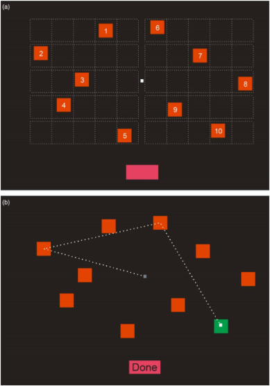

# Standard Corsi-Block-Tapping Study Assessment
**CS3160 - Final Assessment Project**
 
> This Final Assessment Project utilizes the Standard Corsi-Block-Tapping Study to assess Visuo-Spatial Short-Term Working Memory.

The Corsi-Block-Tapping Test is used to test a variety of things including memory loss, testing of brain damaged patients, spatial memory, and nonverbal working memory. It involves mimicking a researcher as they tap a sequence of up to nine identical spatially separated blocks. The sequence starts out simple, usually using two blocks, but becomes more complex until the subject's performance suffers. This number is known as the Corsi Span, and average is about 5-6 for typically 'normal' human subjects.

## The Test
 

Certain software parameters were established by the `CS3160` Instructor/Professor.
Requirements for completion:
- *The block test is to be executed with random sequences. No block order can be the same, sequentially.*
- *Logs must be generated from all user actions: including block-space, block-color, block-sequence, and more.*
- *The test must support user login, individual passwords and usernames.*
- *Scoreboards and a working score system for all system users, based on succeeded block-tests.*

 

## References
- [Official Corsi Block Tapping Study](https://www.ncbi.nlm.nih.gov/pmc/articles/PMC5619435/#:~:text=The%20Corsi%20block%2Dtapping%20test%20was%20developed%20in%201971%20as,memory%20with%20minimal%20verbal%20mediation.&text=The%20test%20requires%20the%20maintenance,for%20a%20pathway%20between%20objects.)
- [Corsi Block Tapping Test (Wiki)](https://en.wikipedia.org/wiki/Corsi_block-tapping_test)
